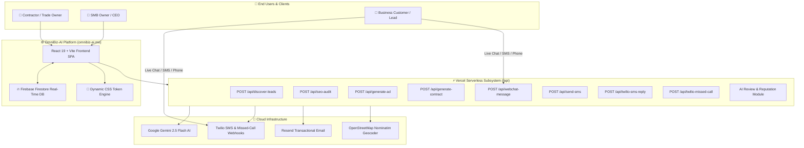

# 🚀 OmniBiz-AI — The Self-Building Business Operating System
### Live Production TLD: [https://omnibiz-ai.me](https://omnibiz-ai.me)

**OmniBiz-AI** is an autonomous, self-building SaaS platform designed to liberate small-to-medium business (SMB) owners and blue-collar contractors (HVAC, Plumbing, Auto Repair, Handymen) from tedious paperwork, manual review management, lost phone leads, and unoptimized local marketing.

By combining autonomous **Gemini 2.5 Flash AI**, **Twilio Telephony & SMS**, **Resend Email**, **Firebase Firestore**, and a **Self-Building CSS Theme Engine**, OmniBiz-AI provides every business owner with an enterprise-level AI Executive Assistant that runs operations 24/7 on autopilot.

---

## 🌟 The Investor & Client Pitch

> *"Small business owners love their craft—whether fixing an HVAC compressor, crafting culinary dishes, or designing fashion lines—but they despise paperwork, writing invoices, managing local SEO, and losing missed phone calls. OmniBiz-AI turns every business owner into an enterprise-level CEO, automating 80%+ of administrative headaches from day one."*

### Key Highlights
- 🛠️ **Purpose-Built for Contractors & Local Trades**: 1-Tap Job Estimator, itemized quote dispatching via SMS, and digital signature capture eliminate paperwork pain.
- 💬 **24/7 AI Receptionist & Missed-Call Responder**: Instant SMS textback on missed calls and live webchat receptionist configured with real employee directories.
- ⭐ **AI Reputation & Review Response Engine**: Multi-platform (Google & Yelp) sentiment analyzer and instant tone-matched review responder.
- 📍 **Hyper-Local SEO & Schema.org Generator**: 1-Click site audit and LocalBusiness JSON-LD microdata builder for top Google Maps positioning.
- 🎨 **Self-Building Theme Engine**: Onboarding automatically re-configures the app's visual identity, preset templates, and AI prompts across 8 core industry verticals.

---

## 🏗️ System Topology & Flow Diagram



---

## 📁 Repository Directory Structure

The repository is neatly organized and strictly partitioned:

```text
OmniBiz-AI/
├── api/                            # Vercel Serverless Functions (Node.js)
│   ├── README.md                   # Technical API catalog & sequence diagrams
│   ├── admin-settings.js           # Platform configuration manager
│   ├── competitor-analysis.js      # AI competitor intelligence & pricing benchmark
│   ├── discover-leads.js           # Google Search Grounding & OSM local prospect finder
│   ├── generate-ad.js              # Google Ads & Meta campaign copy generator
│   ├── generate-contract.js        # SLA, NDA, and Trade Estimate contract compiler
│   ├── send-email.js               # Resend transactional email dispatcher
│   ├── send-sms.js                 # Twilio REST outbound text engine
│   ├── seo-audit.js                # Page crawler, SEO scorer & local keyword analyzer
│   ├── tts.js                      # Text-to-speech audio synthesis engine
│   ├── twilio-missed-call.js       # Missed call automated SMS textback responder
│   ├── twilio-sms-reply.js         # Conversational SMS AI receptionist webhook
│   ├── webchat-message.js          # Grounded live website webchat responder
│   └── _utils/                     # Shared GCP & API helper utilities
│       └── gcp.js                  # GCP Vertex/Gemini authentication helpers
├── electron/                       # Desktop Native Application Wrapper
│   ├── README.md                   # Electron packaging documentation
│   ├── main.cjs                    # Main process BrowserWindow setup
│   └── preload.cjs                 # IPC security bridge
├── public/                         # Public Assets & Webchat Snippets
│   ├── README.md                   # Asset inventory & embed documentation
│   ├── favicon.svg                 # Vector brand mark
│   ├── icons.svg                   # Sprite icon manifest
│   └── widget.html                 # Embeddable 24/7 webchat iframe
├── src/                            # Single Page Application Frontend
│   ├── README.md                   # Architecture & CSS theme engine docs
│   ├── main.jsx                    # React 19 entry point
│   ├── App.jsx                     # Router, global Firestore sync, dynamic theme engine
│   ├── firebase.js                 # Firebase initialization script
│   ├── index.css                   # Glassmorphic CSS design system & variables
│   └── components/                 # Component tree
│       ├── Sidebar.jsx             # Left navigation & tier badge
│       ├── Onboarding.jsx          # Setup wizard with 8 industry presets
│       ├── ShowcaseRecorder.jsx    # Built-in screen demo recorder
│       ├── PhantomCursor.jsx       # Demo cursor simulator
│       ├── BackendViewer.jsx       # Serverless function log monitor
│       └── views/                  # Operational module views
│           ├── CommandCenter.jsx   # ROI metrics & executive AI copilot
│           ├── AutomationSuite.jsx # 24/7 AI Receptionist & AI Review Response Hub
│           ├── LeadGen.jsx         # Prospect finder with OpenStreetMap & priority scoring
│           ├── SEOManager.jsx      # Website auditor & Schema.org JSON-LD microdata builder
│           ├── AdManager.jsx       # AI Google & Facebook Ad copy & demographic builder
│           ├── ContractManager.jsx # Trade job estimator, quote dispatches, & contract hub
│           ├── CompetitorAnalysis.jsx # Competitor intelligence & benchmarking tool
│           ├── AgencyDashboard.jsx # Multi-tenant client workspace switcher
│           ├── SettingsManager.jsx # Twilio credentials, team directory & receptionist prompt editor
│           └── BillingManager.jsx  # Plan tiers (Free, Starter, Pro, Enterprise) & checkout
├── firestore.rules                 # Security rules for Cloud Firestore
├── vercel.json                     # Serverless rewrite rules for Vercel
├── vite.config.js                  # Frontend Vite bundler configuration
└── package.json                    # Project dependencies & build scripts
```

---

## 🎨 Supported Industry Presets

OmniBiz-AI automatically adapts to 8 core business verticals:

| Industry Niche | Accent Colors | AI Receptionist Tone | Key Features Tailored |
| :--- | :--- | :--- | :--- |
| **🔧 Plumbing & HVAC** | Safety Orange / Emerald | Direct, Helpful, Urgent Dispatch | 1-Tap Job Estimator, Emergency SMS Textback, Part Lists |
| **🚗 Auto Repair & Towing** | Steel Blue / Amber | Technical, Clear, Trustworthy | Estimate Dispatches, Warranty Disclaimers, Service Logs |
| **🔨 Handyman & Remodeling** | Warm Rust / Teal | Friendly, Detail-Oriented | Quote Signatures, Scope of Work SLAs, Before/After Notes |
| **🍕 Restaurants & Cafes** | Espresso / Warm Gold | Hospitable, Welcoming | Reservation FAQs, Menu Q&A, Google Review Auto-Responder |
| **👗 Fashion & Boutique** | Blush Pink / Rose Gold | Elegant, Trendy | Inventory Inquiries, Custom Order Agreements, Styling Q&A |
| **⛽ Gas Station & Store** | Royal Blue / Gold | Quick, Informative | Hours/Fuel Info, Supply Invoices, Local SEO Schema |
| **💻 Tech & SaaS** | Cyber Cyan / Purple | Innovator, Tech-Savvy | SLA Contracts, Lead Scoring, Ad Copy Generators |
| **⚖️ Professional Services** | Navy / Metallic Steel | Authoritative, Formal | Engagement NDAs, Client Intake, Appointment Booking |

---

## 🚀 Getting Started & Development

### 1. Prerequisites
- **Node.js**: v18 or higher recommended.
- **npm**: v9 or higher.

### 2. Installation
```bash
git clone https://github.com/your-org/omnibiz-ai.git
cd omnibiz-ai
npm install
```

### 3. Environment Setup
Create a `.env.local` file in the root directory:
```env
GEMINI_API_KEY="AIzaSy..."
TWILIO_ACCOUNT_SID="AC..."
TWILIO_AUTH_TOKEN="..."
TWILIO_PHONE_NUMBER="+1..."
RESEND_API_KEY="re_..."
```

### 4. Local Development Server
```bash
npm run dev
```

### 5. Production Compilation
```bash
npm run build
```

Deployed live at [https://omnibiz-ai.me](https://omnibiz-ai.me).
