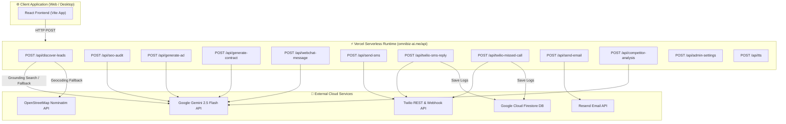

# ⚡ OmniBiz-AI API Subsystem (`api/`)

The `api/` directory houses the Vercel Serverless Functions powering **OmniBiz-AI** (`omnibiz-ai.me`). These endpoints handle AI generation via Google Gemini 2.5 Flash, SMS & telephony dispatching via Twilio, transactional email via Resend, competitor intelligence, and local SEO analysis.

---

## 🏗️ Architecture & Data Flow Diagram



---

## 📡 API Endpoint Reference Catalog

All endpoints export a standard Node.js serverless handler: `export default async function handler(req, res)`.

| Endpoint | HTTP Method | Request Body Parameters | Output Format | Primary Responsibility |
| :--- | :--- | :--- | :--- | :--- |
| `/api/discover-leads` | `POST` | `{ category, location }` | `JSON Array` | Local business search using Gemini Search Grounding & OSM geocoding fallback. Scores prospect lead priority (60-95). |
| `/api/seo-audit` | `POST` | `{ url, category }` | `JSON Object` | Analyzes website performance, mobile viewport, local schema tags, and provides actionable recommendations. |
| `/api/generate-ad` | `POST` | `{ businessData, platform, budget, objective }` | `JSON Object` | Generates conversion-focused Google Ads & Meta (Facebook/Instagram) campaign copy, target keywords, and demographics. |
| `/api/generate-contract` | `POST` | `{ template, clientName, businessData, lineItems }` | `JSON Object` | Compiles formal legal SLAs, NDAs, and contractor job estimates complete with legal terms and itemized pricing. |
| `/api/webchat-message` | `POST` | `{ message, history, businessData }` | `JSON Object` | 24/7 AI Receptionist live website chat engine matching custom employee personas and company info. |
| `/api/twilio-sms-reply` | `POST` | Twilio Webhook Form (`From`, `Body`) | `TwiML XML` | Handles incoming SMS webhooks from Twilio and returns contextual AI receptionist replies. |
| `/api/twilio-missed-call` | `POST` | Twilio Call Status Form | `TwiML XML` | Automated missed call detector; dispatches immediate SMS textback to caller ("Sorry we missed your call..."). |
| `/api/send-sms` | `POST` | `{ to, body }` | `JSON Object` | Dispatches outbound SMS messages via Twilio REST API using saved credentials. |
| `/api/send-email` | `POST` | `{ to, subject, html, businessData }` | `JSON Object` | Sends formatted transactional emails and client estimates via Resend REST API. |
| `/api/competitor-analysis`| `POST` | `{ category, location, businessName }` | `JSON Object` | Performs AI competitor intelligence, pricing benchmarking, and market positioning analysis. |
| `/api/admin-settings` | `POST` | `{ action, settingsData }` | `JSON Object` | Reads and updates platform-wide system settings and API integrations. |
| `/api/tts` | `POST` | `{ text, voice }` | `JSON Object` | Converts text to speech audio payloads for AI receptionist voice simulations. |

---

## 🔑 Environment Variables Required

Ensure these environment variables are set in `.env.local` or inside the **Vercel Project Settings**:

```env
GEMINI_API_KEY="AIzaSy..."       # Google Gemini API key (Gemini 2.5 Flash)
TWILIO_ACCOUNT_SID="AC..."      # Twilio Account SID
TWILIO_AUTH_TOKEN="..."          # Twilio Auth Token
TWILIO_PHONE_NUMBER="+1..."      # Twilio Virtual Phone Number
RESEND_API_KEY="re_..."          # Resend API Key for emails
```

---

## 🛡️ Security & Fail-Safe Mechanisms

1. **CORS Handling**: Every function explicitly sets header `Access-Control-Allow-Origin: *` and responds to `OPTIONS` preflight requests cleanly.
2. **Robust Fallbacks**: If external API limits are reached, endpoints fallback seamlessly to deterministic local models or cached dataset generation without crashing the UI.
3. **JSON Extraction**: Responses from Gemini pass through robust Markdown-fence stripping (`parseStructuredJSON`) to prevent UI syntax errors.
