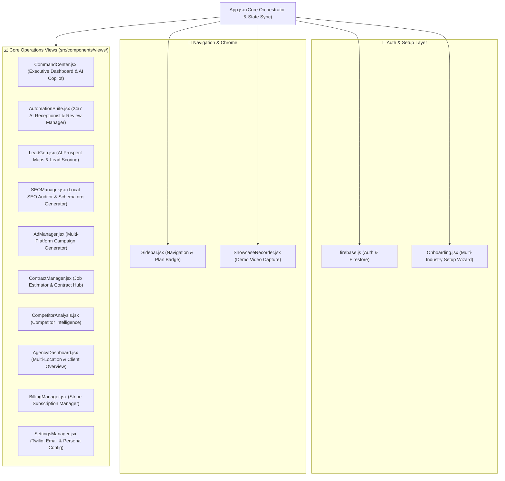

# 🎨 OmniBiz-AI Frontend Subsystem (`src/`)

The `src/` directory contains the React 19 Single Page Application (SPA) built with Vite for **OmniBiz-AI** (`omnibiz-ai.me`). It delivers a self-building business management system with dynamic CSS token compilation, multi-industry theme engine, real-time Firebase Firestore synchronization, and interactive AI operations suites.

---

## 🏛️ Component Architecture & Hierarchy Diagram



---

## 🎨 Self-Building UI & Dynamic CSS Theme Engine

OmniBiz-AI dynamically re-compiles root CSS variables based on the active business industry and theme preset:

```javascript
// Dynamic CSS Token Injector in App.jsx
document.documentElement.style.setProperty('--accent-purple', activePreset.primary);
document.documentElement.style.setProperty('--accent-cyan', activePreset.secondary);
document.body.style.backgroundColor = activePreset.bg;
```

### Supported Industry Theme Presets:
1. **Cyber SaaS** (`#8b5cf6` / `#06b6d4`) — Designed for tech startups & SaaS founders.
2. **Rugged Services** (`#f97316` / `#10b981`) — Tailored for Contractors, HVAC, Plumbing, Auto Repair & Trades.
3. **Rose Boutique** (`#ec4899` / `#f472b6`) — Crafted for Fashion Designers, Retail & Beauty Salons.
4. **Warm Cafe** (`#d97706` / `#fbbf24`) — Engineered for Restaurants, Food Trucks, Cafes & Bakeries.
5. **Ocean Wellness** (`#10b981` / `#06b6d4`) — Geared for Spas, Gyms, Clinics & Health Centers.
6. **Navy Corporate** (`#2563eb` / `#fbbf24`) — Formatted for Gas Stations, Convenience Stores, Legal & Financial Services.

---

## 📁 Subdirectory File Breakdown

```text
src/
├── main.jsx                 # Entry point initializing React root and index.css
├── App.jsx                  # Main router, global Firestore listeners, dynamic styling engine
├── firebase.js              # Firebase SDK configuration and Firestore db instance export
├── index.css                # Glassmorphic design system tokens, keyframe animations, typography
└── components/              # UI Component Directory
    ├── Sidebar.jsx          # Left-hand navigation sidebar with plan indicators and tier locks
    ├── Onboarding.jsx       # 4-step wizard for company profile, theme, and staff directory
    ├── ShowcaseRecorder.jsx # Built-in web screen recorder for client demo generation
    ├── PhantomCursor.jsx    # Autonomous automated cursor demo simulator
    ├── BackendViewer.jsx    # Live serverless function log inspector
    └── views/               # Operational module components
        ├── CommandCenter.jsx   # ROI counter, AI system directives, quick actions
        ├── AutomationSuite.jsx # Live WebChat, SMS reception, and AI Review Response Hub
        ├── LeadGen.jsx         # Prospect finder with OpenStreetMap & priority scoring
        ├── SEOManager.jsx      # Website auditor & Schema.org JSON-LD microdata builder
        ├── AdManager.jsx       # AI Google & Facebook Ad copy & demographic builder
        ├── ContractManager.jsx # Trade job estimator, quote dispatches, & contract hub
        ├── CompetitorAnalysis.jsx # Competitor intelligence & benchmarking tool
        ├── AgencyDashboard.jsx # Multi-tenant client workspace switcher
        ├── SettingsManager.jsx # Twilio credentials, team directory & receptionist prompt editor
        └── BillingManager.jsx  # Plan tiers (Free, Starter, Pro, Enterprise) & checkout
```

---

## 🚀 Running Local Frontend Development

```bash
# Start Vite development server with Hot Module Replacement (HMR)
npm run dev
```

App opens at `http://localhost:5173`.
